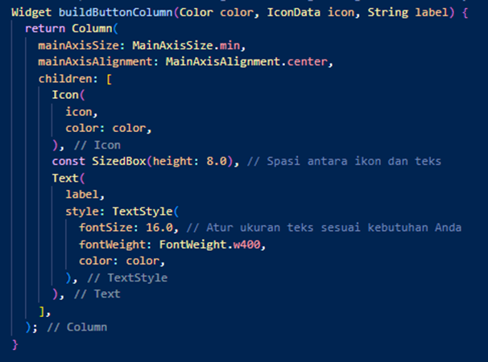

# week7

Laporan Praktikum Pertemuan 7
Pemrograman Mobile
1.	Praktikum 1: Membangun Layout di Flutter

    1.	Langkah 1

        
        
        Jadi pada langkah pertama buat project dengan tekan ctrl+shift+p dan pilih opsi diatas. Kemudian pilih lokasi file untuk menyimpan project.
 

    2.	Langkah 2 

        

        Ubah kode sesuai perintah pada langkah 2 susai perintah.

    3.	Langkah 3

        
    
        Identifikasi layout diagram
  
    4.	Langkah 4

        
        
        Hasil implementasi kode yang diberikan.
 

        1.	Soal 1 

            
            
            Pengubahan property CrossAxisAligment.start
 

        2.	Soal 2
 
            
            
            Penambahan padding dan penggantian warna teks.
        3.	Soal 3
 
            
            
            Pengubahan warna icon dan textnya menjadi merah.
2.	Praktikum 2: Implementasi button row
    1.	Langkah 1 : Buat method Column _buildButtonColumn
 
	    
        
        Dalam langkah pertama proses yang dijalankan yaitu pendeklarasian variable dan proses cetak nilai.
    2.	Langkah 2 : Buat widget buttonSection
 
        
        
        Penambahan widget buttonSection
    3.	Langkah 3 : Tambah button section ke body

        

	 
3.	Praktikum 3: Implementasi text section
    1.	Langkah 1 : Buat widget textSection
  
	    
        
        Penambahan text section.
    2.	Langkah 2 : Tambahkan variabel text section ke body
 
        
        
        Penambahan text section.
4.	Praktikum 4: Implementasi image section
    1.	Langkah 1 : Siapkan aset gambar
 
        
        
        Saya membuat folder baru dengan foto yang dimaksud.
    2.	Langkah 2 : Tambahkan gambar ke body
 
        
        
        Saya menambahkan foto ke body.
    3.	Langkah 3 : : Terakhir, ubah menjadi ListView
 
        
        
        Pengubahan menjadi listview.

4.	Kumpulkan berupa link commit repo GitHub 
-	https://github.com/Agilar011/Mobile_week7
